Summarize drug comparison
================
Jacki Novik
5/4/2017

Data summary
------------

We are analyzing data from the `aids` dataset, provided by the [JM package](https://cran.r-project.org/web/packages/JM/index.html).

A brief description of the data are provided in the [package documentation](https://rdrr.io/cran/JM/man/aids.html), with more detail in [the original manuscript](https://www.ncbi.nlm.nih.gov/pubmed/8556398).

For our purposes, it's perhaps sufficient know that we are looking at data from a clinical trial published in 1996. This trial enrolled 467 patients with an HIV diagnosis who were either intolerant or resistant to AZT treatment. Patients were randomized to receive one of two drugs - we will call them `ddI` (didanosine) and `ddC` (zalcitabine).

Data are provided in two formats -

-   `aids` contains longitudinal measures (several obs per patient)
-   `aids.id` contains values at time of randomization (one obs per patient)

``` r
data(aids, package = "JM")
data(aids.id, package = "JM")
```

### Survival submodel

#### Data exploration

Overall, there is differential survival according to treatment.

``` r
aids.id %>%
  survfit(Surv(Time, death) ~ drug, data = .) %>%
  ggsurvplot(risk.table = FALSE,
             risk.table.y.text = FALSE,
             #ncensor.plot = TRUE,
             #surv.median.line='v',
             conf.int = TRUE,
             size = 0.5, 
             xlab = 'months',
             data = aids.id) +
  ggtitle('Survival among all patients') +
  scale_y_continuous(labels = percent)
```

    ## Scale for 'y' is already present. Adding another scale for 'y', which
    ## will replace the existing scale.


However, this trial enrolled patients according to previous opportunistic infection status (AIDS vs noAIDS) and according to AZT status (intolerance vs resistant). This prior status has pretty important prognostic value and may impact response to therapy.

Here, for example, are survival curves among patients without prior opportunistic infections (ie, no AIDs at time of enrollment).

``` r
plot_noaids <- aids.id %>%
  dplyr::filter(prevOI == 'noAIDS') %>%
  survfit(Surv(Time, death) ~ drug, data = .) %>%
  ggsurvplot(risk.table = FALSE,
             risk.table.y.text = FALSE,
             #ncensor.plot = TRUE,
             #surv.median.line='v',
             conf.int = TRUE,
             size = 0.5, 
             xlab = 'months',
             data = aids.id %>%
               dplyr::filter(prevOI == 'noAIDS')) +
  ggtitle('Patients without previous infections (no AIDs)') +
  scale_y_continuous(labels = percent)
```

    ## Scale for 'y' is already present. Adding another scale for 'y', which
    ## will replace the existing scale.

``` r
plot_noaids
```


By comparison, showing survival among patients with prior opportunitistic infections.

``` r
plot_aids <- aids.id %>%
  dplyr::filter(prevOI == 'AIDS') %>%
  survfit(Surv(Time, death) ~ drug, data = .) %>%
  ggsurvplot(risk.table = FALSE,
             risk.table.y.text = FALSE,
             #ncensor.plot = TRUE,
             surv.median.line='v',
             conf.int = TRUE,
             size = 0.5, 
             xlab = 'months',
             data = aids.id %>%
               dplyr::filter(prevOI == 'AIDS')) +
  ggtitle('Patients with previous opportunistic infections (AIDs)') +
  scale_y_continuous(labels = percent)
```

    ## Scale for 'y' is already present. Adding another scale for 'y', which
    ## will replace the existing scale.

``` r
plot_aids
```

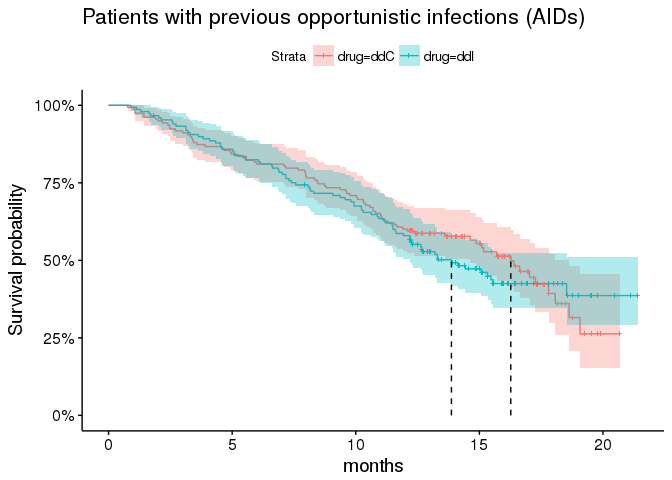

Other important indicators include AZT status

``` r
plot_by_azt <- aids.id %>%
  survfit(Surv(Time, death) ~ AZT, data = .) %>%
  ggsurvplot(risk.table = FALSE,
             risk.table.y.text = FALSE,
             #ncensor.plot = TRUE,
             surv.median.line='v',
             conf.int = TRUE,
             size = 0.5, 
             xlab = 'months',
             data = aids.id
             ) +
  ggtitle('Among all patients') +
  scale_y_continuous(labels = percent)
```

    ## Scale for 'y' is already present. Adding another scale for 'y', which
    ## will replace the existing scale.

``` r
plot_by_azt
```

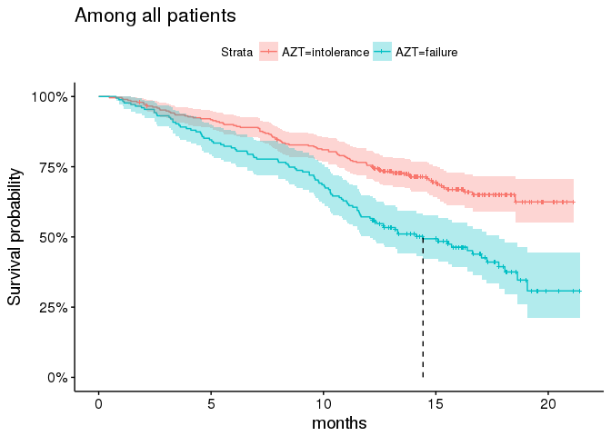

And gender, although the majority of patients enrolled are male.

``` r
plot_by_gender <- aids.id %>%
  survfit(Surv(Time, death) ~ gender, data = .) %>%
  ggsurvplot(risk.table = FALSE,
             risk.table.y.text = FALSE,
             #ncensor.plot = TRUE,
             surv.median.line='v',
             conf.int = TRUE,
             size = 0.5, 
             xlab = 'months',
             data = aids.id
             ) +
  ggtitle('Among all patients') +
  scale_y_continuous(labels = percent)
```

    ## Scale for 'y' is already present. Adding another scale for 'y', which
    ## will replace the existing scale.

``` r
plot_by_gender
```

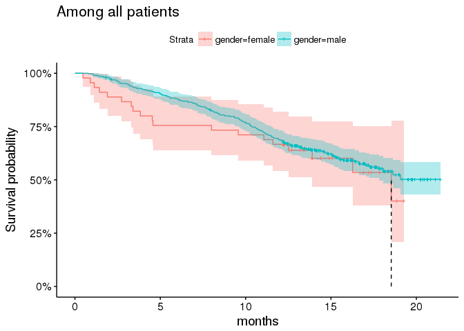

#### Parameterizing the submodel

Taking these factors into account, we end up with a survival submodel as follows:

``` r
surv_form <- as.formula(Surv(Time, death) ~ drug*prevOI + gender + AZT)
```

which has the following MLE estimates from the standard cox-ph model:

``` r
cox.fit <- coxph(surv_form, data = aids.id)
summary(cox.fit)
```

    ## Call:
    ## coxph(formula = surv_form, data = aids.id)
    ## 
    ##   n= 467, number of events= 188 
    ## 
    ##                       coef exp(coef) se(coef)      z Pr(>|z|)    
    ## drugddI             1.0139    2.7565   0.4185  2.423   0.0154 *  
    ## prevOIAIDS          1.8593    6.4194   0.3841  4.840  1.3e-06 ***
    ## gendermale         -0.3266    0.7213   0.2453 -1.332   0.1830    
    ## AZTfailure          0.1538    1.1663   0.1635  0.941   0.3468    
    ## drugddI:prevOIAIDS -0.9269    0.3958   0.4476 -2.071   0.0384 *  
    ## ---
    ## Signif. codes:  0 '***' 0.001 '**' 0.01 '*' 0.05 '.' 0.1 ' ' 1
    ## 
    ##                    exp(coef) exp(-coef) lower .95 upper .95
    ## drugddI               2.7565     0.3628    1.2138    6.2598
    ## prevOIAIDS            6.4194     0.1558    3.0235   13.6295
    ## gendermale            0.7213     1.3863    0.4460    1.1667
    ## AZTfailure            1.1663     0.8574    0.8465    1.6067
    ## drugddI:prevOIAIDS    0.3958     2.5266    0.1646    0.9515
    ## 
    ## Concordance= 0.645  (se = 0.022 )
    ## Rsquare= 0.136   (max possible= 0.99 )
    ## Likelihood ratio test= 68.17  on 5 df,   p=2.467e-13
    ## Wald test            = 45.72  on 5 df,   p=1.034e-08
    ## Score (logrank) test = 56.92  on 5 df,   p=5.265e-11

#### Including baseline value of longitudinal covariate `CD4`

The longitudinal endpoint of interest here is `CD4` count. CD4+ cells are a type of T cell, and they play a critical part of the immune system function. Their levels are often depressed in aids patients, particularly as the disease progresses.

We thus expect higher levels of CD4 count to be associated with improved survival.

Before considering the longitudinal submodel, we should include the baseline value of `CD4` count in our survival submodel. We do this for two reasons - (1) to sanity check our expectation of improved survival with higher levels of CD4 count, and (2) to see how the inclusion of this covariate impacts our parameter estimates.

``` r
cox.fit2 <- coxph(update(surv_form, ~ . + CD4), data = aids.id)
summary(cox.fit2)
```

    ## Call:
    ## coxph(formula = update(surv_form, ~. + CD4), data = aids.id)
    ## 
    ##   n= 467, number of events= 188 
    ## 
    ##                       coef exp(coef) se(coef)      z Pr(>|z|)    
    ## drugddI             1.1513    3.1623   0.4194  2.745 0.006054 ** 
    ## prevOIAIDS          1.4074    4.0854   0.3867  3.639 0.000273 ***
    ## gendermale         -0.2173    0.8047   0.2440 -0.891 0.373110    
    ## AZTfailure          0.1339    1.1433   0.1622  0.825 0.409116    
    ## CD4                -0.1516    0.8593   0.0237 -6.396  1.6e-10 ***
    ## drugddI:prevOIAIDS -1.0503    0.3498   0.4484 -2.343 0.019153 *  
    ## ---
    ## Signif. codes:  0 '***' 0.001 '**' 0.01 '*' 0.05 '.' 0.1 ' ' 1
    ## 
    ##                    exp(coef) exp(-coef) lower .95 upper .95
    ## drugddI               3.1623     0.3162    1.3899    7.1949
    ## prevOIAIDS            4.0854     0.2448    1.9146    8.7179
    ## gendermale            0.8047     1.2427    0.4988    1.2981
    ## AZTfailure            1.1433     0.8747    0.8319    1.5711
    ## CD4                   0.8593     1.1637    0.8203    0.9002
    ## drugddI:prevOIAIDS    0.3498     2.8586    0.1453    0.8424
    ## 
    ## Concordance= 0.725  (se = 0.022 )
    ## Rsquare= 0.223   (max possible= 0.99 )
    ## Likelihood ratio test= 117.9  on 6 df,   p=0
    ## Wald test            = 81.02  on 6 df,   p=2.22e-15
    ## Score (logrank) test = 96.08  on 6 df,   p=0

As we suspected, higher `CD4` count is associated with better prognosis in this cohort. It is also notable that the inclusion of this covariate substantially increases the benefit of drug `ddI` (didanosine) over `ddC` (zalcitabine), and lessens the magnitude of association between prior AIDS status and survival, as well as its interaction with the drug effect.

This would suggest that the impact of prior AIDS on survival is explained at least in part by differences in CD4 levels.

Which is indeed the case.

``` r
ggplot(aids.id, aes(x = CD4, group = prevOI, colour = prevOI)) +
  geom_density() +
  theme_minimal() +
  ggtitle('CD4 count at baseline by previous OI (opportunistic infection) status')
```

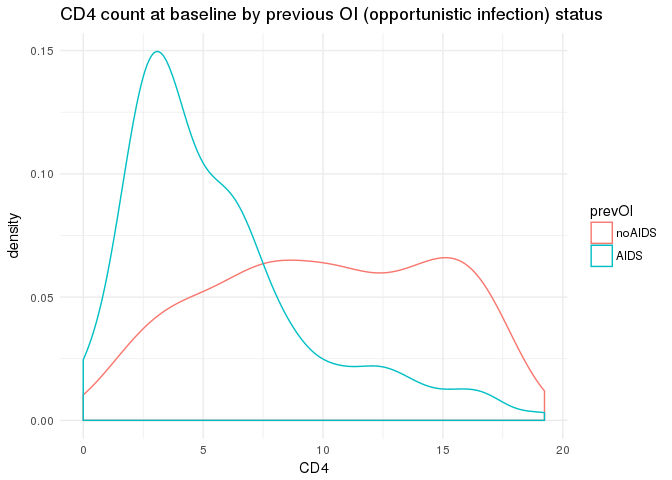

Cool. At this point, we are ready to investigate the longitudinal submodel.

### Longitudinal submodel

We now begin to investigate the longitudinal (on-treatment) measurements of `CD4` count.

As noted above, we would expect higher levels of CD4 count to be associated with improved survival. We also now expect these measurements (at least at baseline) to be correlated with previous AIDS status.

Here we plot trajectories of CD4 count over the course of treatment for each patient, by previous infection status.

``` r
ggplot(aids, aes(x = obstime, y = CD4, group = patient, colour = prevOI)) +
  geom_line(alpha = 0.2) +
  scale_x_continuous('months') +
  theme_minimal() +
  ggtitle('CD4 count over time per patient, according to previous infection status')
```

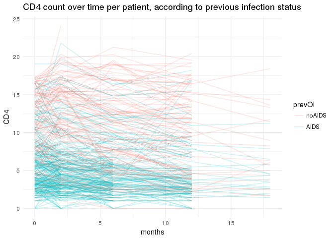

You will notice that timepoints of collection here are highly regular, although we do have some missing values. At each timepoint, there are also waves of censoring in the longitudinal data.

It is customary to use `sqrt(CD4)` when modeling these data instead of CD4. Although it's not strictly necessary for our model, we will proceed with this convention.

``` r
ggplot(aids2 %>% 
         dplyr::mutate(`sqrt(CD4)` = sqrt_cd4) %>%
         tidyr::gather('variable', 'value', CD4, `sqrt(CD4)`),
       aes(x = value, group = variable, colour = variable)) + 
  geom_density() +
  facet_wrap(~variable, scales = 'free') +
  theme_minimal() +
  theme(legend.position = 'none')
```

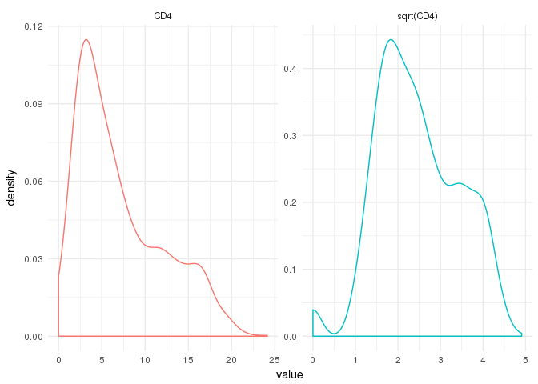

Here we are fitting a longitudinal submodel of the form:

\_ TODO describe long submodel \_

We have fit several parameterizations of the longitudinal submodel using `rstanarm::stan_glmer`

``` r
loo_comp_table %>% dplyr::select(model_name, description) %>% arrange(model_name) %>% dplyr::filter(model_name != 'long6') %>% print(right=F)
```

    ##   model_name
    ## 1 long0     
    ## 2 long1     
    ## 3 long2     
    ## 4 long3     
    ## 5 long4     
    ## 6 long5     
    ##   description                                                                                                               
    ## 1 sqrt(CD4) ~ obstime + (1 | patient)                                                                                       
    ## 2 sqrt(CD4) ~ obstime + (1 + obstime | patient)                                                                             
    ## 3 sqrt(CD4) ~ obstime * drug + (1 + obstime | patient)                                                                      
    ## 4 sqrt(CD4) ~ obstime + drug + obstime:drug + gender + prevOI + AZT + (1 + obstime | patient)                               
    ## 5 sqrt(CD4) ~ obstime + drug + obstime:drug + prevOI + obstime:prevOI + gender + AZT + (1 + obstime | patient)              
    ## 6 sqrt(CD4) ~ obstime + drug + obstime:drug + prevOI + obstime:prevOI + drug:prevOI + gender + AZT + (1 + obstime | patient)

Using `LOO-PSIS` as a model-comparison criterion, we can sort models from the best fit (`long3`) to the worst (`long0`).

``` r
loo_comp_table %>% dplyr::select(model_name, looic, se_looic) %>% print(right=F)
```

    ##   model_name looic    se_looic
    ## 1 long3      1926.718 91.69184
    ## 2 long2      1930.031 90.83887
    ## 3 long5      1930.792 92.13360
    ## 4 long4      1932.482 92.60514
    ## 5 long6      1933.828 91.95204
    ## 6 long1      1952.837 93.82012
    ## 7 long0      2044.633 94.16735

From the perspective of model comparison, there are a few things to note:

1.  The biggest improvements in fit came from:
    -   allowing slope of `CD4` over time to vary by patient (long0 -&gt; long1)
    -   including tx effect & allowing slope of `CD4` over time to vary by tx (long1 -&gt; long2)
    -   including covariate effects of for `prevOI` and `AZT` (long2 -&gt; long3)

2.  There was very little improvement in fit when we included an interaction between the slope of `CD4` (`obstime`) & `prevOI` (long4), whether this was included with or without interactions between drug & `prevOI` or other interaction effects.

I would also note the slight interaction effect between drug (`ddI`) and `obstime`, since any differential survival due to treatment might be mediated by effect of treatment on the rate of change in `CD4`.

Let's summarize the posterior parameter estimates for `long3`.

``` r
long3 <- readRDS(file = file.path(CACHE_DIR, 'long3.rds'))
print(long3)
```

    ## stan_glmer(formula = sqrt(CD4) ~ obstime + drug + obstime:drug + 
    ##     gender + prevOI + AZT + (1 + obstime | patient), data = aids)
    ## 
    ## Estimates:
    ##                 Median MAD_SD
    ## (Intercept)      3.1    0.1  
    ## obstime          0.0    0.0  
    ## drugddI          0.1    0.1  
    ## gendermale       0.0    0.1  
    ## prevOIAIDS      -0.9    0.1  
    ## AZTfailure      -0.1    0.1  
    ## obstime:drugddI  0.0    0.0  
    ## sigma            0.4    0.0  
    ## 
    ## Error terms:
    ##  Groups   Name        Std.Dev. Corr 
    ##  patient  (Intercept) 0.763         
    ##           obstime     0.037    -0.05
    ##  Residual             0.369         
    ## Num. levels: patient 467 
    ## 
    ## Sample avg. posterior predictive 
    ## distribution of y (X = xbar):
    ##          Median MAD_SD
    ## mean_PPD 2.5    0.0   
    ## 
    ## ------
    ## For info on the priors used see help('prior_summary.stanreg').

While it's important to note that inferences from this model aren't valid (due to data not missing at random), we can still investigate the population-level parameter estimates from the model. Mostly because it will be useful to compare these estimates to those obtained from the joint model.

``` r
bayesplot::mcmc_areas(as.array(long3), pars = colnames(coefficients(long3)$patient)[-1]) + 
  bayesplot::vline_0() +
  ggtitle('Posterior parameter estimates for model fit with stan_lmer', subtitle = 'Long3: longitudinal model for assoc with sqrt(CD4) over time (obstime)')
```

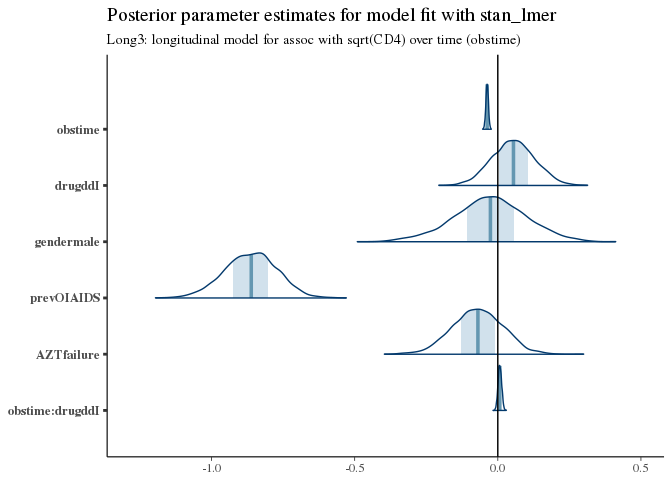

As expected, the CD4 count is generally decreasing in this population -- this is a very sick population (remember this is in 1996!). Also, as expected, having had a prior opportunistic infection (`prevOIAIDS`) leads to lower initial values of `CD4`. Similarly, having had prior AZT failure may confer a worse prognosis.

In order to obtain valid inferences for these parameters, we would need to use the Joint Model which adjusts for the informative censoring due to clinical events.

### Joint model for longitudinal biomarker + survival event data

At this point we are ready to fit the joint model for longitudinal & time-to-event data.

We start with a fit incorporating our work on the individual submodels.

``` r
f7 <- readRDS(file.path(CACHE_DIR, 'f7.rds'))
print(f7)
```

    ## stan_jm(formulaLong = sqrt_cd4 ~ obstime + drug + obstime:drug + 
    ##     gender + prevOI + AZT + (1 + obstime | patient), dataLong = aids2, 
    ##     formulaEvent = Surv(Time, death) ~ drug + prevOI + drug:prevOI + 
    ##         gender + AZT, dataEvent = aids.id, time_var = "obstime", 
    ##     assoc = c("etavalue", "etaslope"), basehaz = "bs", chains = 4, 
    ##     adapt_delta = 0.999)
    ## 
    ## Longitudinal submodel: sqrt_cd4
    ##                 Median MAD_SD
    ## (Intercept)      3.080  0.136
    ## obstime         -0.042  0.005
    ## drugddI          0.061  0.074
    ## gendermale      -0.002  0.135
    ## prevOIAIDS      -0.870  0.091
    ## AZTfailure      -0.072  0.092
    ## obstime:drugddI  0.004  0.007
    ## sigma            0.370  0.011
    ## 
    ## Event submodel:
    ##                    Median MAD_SD exp(Median)
    ## drugddI             1.171  0.405  3.225     
    ## prevOIAIDS          1.301  0.392  3.672     
    ## gendermale         -0.337  0.254  0.714     
    ## AZTfailure          0.131  0.173  1.140     
    ## drugddI:prevOIAIDS -0.960  0.448  0.383     
    ## Long1|etavalue     -0.957  0.142  0.384     
    ## Long1|etaslope     -3.662  5.712  0.026     
    ## basehaz-coef1      -4.504  0.846     NA     
    ## basehaz-coef2      -1.985  0.776     NA     
    ## basehaz-coef3      -3.670  0.763     NA     
    ## basehaz-coef4      -1.447  0.786     NA     
    ## basehaz-coef5      -3.530  1.004     NA     
    ## basehaz-coef6      -2.380  1.392     NA     
    ## 
    ## Group-level random effects:
    ##  Groups  Name              Std.Dev. Corr
    ##  patient Long1|(Intercept) 0.76272      
    ##          Long1|obstime     0.03671  0.02
    ## Num. levels: patient 467

Let's see how closely the estimated 'bs' baseline hazard matches our observed KM curves.

``` r
## TODO uncomment once finished
#f7.ps_check <- readRDS(file.path(CACHE_DIR, 'f7.ps_check.rds'))
#f7.ps_check
```

#### Summarize parameter estimates graphically

``` r
bayesplot::mcmc_areas(as.array(f7), pars = paste('Long1', colnames(coefficients(long3)$patient)[-1], sep = '|')) + 
  bayesplot::vline_0() +
  ggtitle('Posterior parameter estimates for model fit with stan_jm', subtitle = 'f7: longitudinal submodel for assoc with sqrt(CD4) over time (obstime)')
```

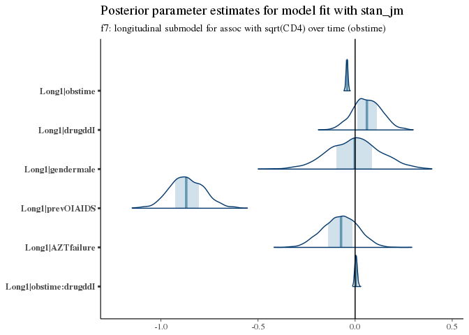

Here we see increased *hazard* (worse survival) with prior opportunistic infections, prior AZT failure, and treatment with `ddI` (didanosine).

For example, the typical trajectory for a patient varies according to `prevOI` and `obstime`, with very little variation due to treatment.

``` r
newdata <- purrr::cross_d(list(prevOI = c('AIDS', 'noAIDS'),
                       obstime = aids2 %>% dplyr::distinct(obstime) %>% unlist(),
                       drug = c('ddI', 'ddC')
                       )) 

newdata.id <- newdata %>%
  dplyr::distinct(prevOI, drug) %>%
  dplyr::mutate(patient = 2000 + row_number()) %>%
  dplyr::mutate(gender = 'male',
                AZT = 'failure')

newdata <- newdata %>%
  dplyr::inner_join(newdata.id, by = c('prevOI', 'drug'))

pplong <- posterior_predict(
  f7,
  m = 1,
  newdata = newdata
)
pplong_df <- newdata %>%
  dplyr::bind_cols(as.data.frame(posterior_interval(pplong))) %>%
  dplyr::bind_cols(as.data.frame(posterior_interval(pplong, prob = 0.01))) %>%
  dplyr::mutate(median = (`49.5%` + `50.5%`)/2)

ggplot(pplong_df, aes(x = obstime, y = median, colour = drug, group = drug)) +
  geom_line() +
  facet_wrap(~prevOI) +
  geom_ribbon(aes(ymin = `5%`, ymax = `95%`, colour = NULL, fill = drug), alpha = 0.2) +
  theme_minimal() +
  ggtitle('Posterior predicted values for prevOI X drug interaction') +
  scale_x_continuous('Months') +
  scale_y_continuous('sqrt(CD4)')
```

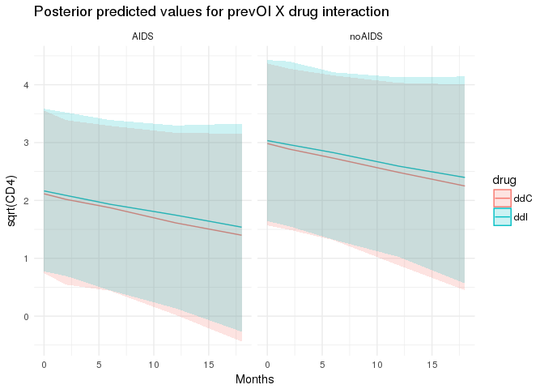

There is better overall survival among men than women, but there isn't a lot of confidence in this signal.

These coefficient estimates are consistent with what we saw in the exploratory analysis & the MLE estimates obtained using `coxph`.

``` r
bayesplot::mcmc_areas(as.array(f7), regex_pars = '^Event\\|[^basehaz]') + 
  bayesplot::vline_0() +
  ggtitle('Posterior parameter estimates for model fit with stan_jm',
          subtitle = 'Event submodel for hazard of mortality')
```

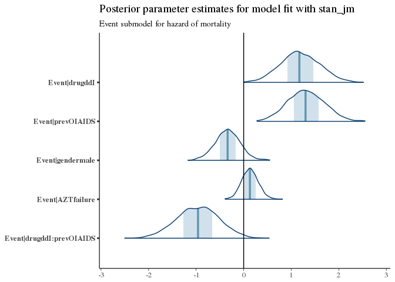

Let's look at the coefficients for `Assoc`, which relates the longitudinal submodel to the event submodel.

``` r
bayesplot::mcmc_areas(as.array(f7), regex_pars = '^Assoc\\|') + 
  bayesplot::vline_0() +
  ggtitle('Posterior parameter estimates for model fit with stan_jm',
          subtitle = 'Association between longitudinal submodel & event submodel (hazard)')
```

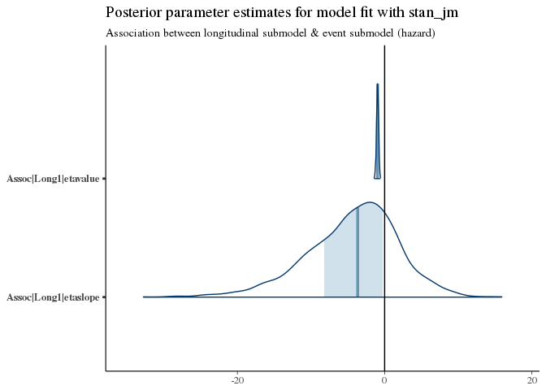

We see a very narrow but somewhat certain association of `etavalue` (the current value at any time of `CD4` count) and subsequent mortality. This is an inverse association, so that higher `CD4` counts yield improved survival (as we expect).

There is also a weak but plausible trend towards improved survival with increasing slopes of `CD4` count.

#### Compare long-model coefficients

Next we compare coefficient values from the longitudinal model fit to their counterparts in the `stan_jm` fit.

``` r
p_joint <- bayesplot::mcmc_areas(as.array(f7), pars = paste('Long1', colnames(coefficients(long3)$patient)[-1], sep = '|')) + 
  bayesplot::vline_0() +
  ggtitle('Fit within Joint Model')

p_long <- bayesplot::mcmc_areas(as.array(long3), pars = colnames(coefficients(long3)$patient)[-1]) + 
  bayesplot::vline_0() +
  ggtitle('Fit as standalone')

bayesplot::bayesplot_grid(p_joint, p_long,
                          grid_args = list(ncol = 2),
                          xlim = c(-1.2, 0.5))
```

    ## Scale for 'x' is already present. Adding another scale for 'x', which
    ## will replace the existing scale.
    ## Scale for 'x' is already present. Adding another scale for 'x', which
    ## will replace the existing scale.

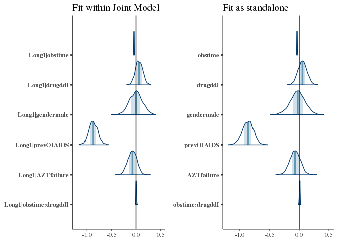

### Summarizing model for example patients

At the population level, how is the outcome different among patients with an AIDS diagnosis, depending on treatment?

Here we will consider only data known at baseline, then draw from the posterior predictive distribution under two treatment scenarios.

``` r
ggplot(with_aids_ddI_ppsurv %>% dplyr::mutate(drug = 'ddI', prevOI = 'AIDS') %>%
         dplyr::bind_cols(with_aids_ddC_ppsurv %>% dplyr::mutate(drug = 'ddC', prevOI = 'AIDS')) %>%
dplyr::bind_cols(no_aids_ddI_ppsurv %>% dplyr::mutate(drug = 'ddI', prevOI = 'noAIDS')) %>%
  dplyr::bind_cols(no_aids_ddC_ppsurv %>% dplyr::mutate(drug = 'ddC', prevOI = 'noAIDS')),
       aes(x = obstime, y = survpred, group = drug, colour = drug)) +
  geom_line() +
  geom_ribbon(aes(ymin = ci_lb, ymax = ci_ub, colour = NULL, fill = drug), alpha = 0.2) +
  facet_wrap(~prevOI) +
  theme_minimal() +
  scale_y_continuous('Posterior-predicted survival', labels = percent) +
  scale_x_continuous('Months')
```


The decision problem
--------------------

Now we get to the crux of the issue - namely, informing the treatment plan for an individual patient.

Given the model, you might think that we could simply treat all patients with `ddC`, since `ddI` is associated with higher hazard for mortality.

However, the picture may not be that simple.

First, the model is not simple. We have an interaction effect between treatment status & prevOI, but we also have slightly higher `CD4` counts with `ddI` (which is associated with improved survival) and slightly higher hazard with `ddI` (which is thus associated with worse survival). Our model also measures the drug effect *holding all other covariates equal* .. including `CD4` count. But `CD4` count as we have seen often varies over time and differently for different patients.

Second, even if our model *were* simple, the decision problem is itself complex.

Consider:

1.  The survival benefit of `ddC` over `ddI` may not be the same over all patients.
    -   There may be a subset of patients for whom `ddI` is just as good as `ddC`
    -   There may also be a subset of patients for whom `ddI` is better than `ddC`
    -   The relative benefit of each drug may *change* over the course of treatment

2.  In addition, survival is not the only outcome to consider.
    -   The side-effects from the two drugs may not be comparable
    -   The risk of adverse events may vary by patient, and/or by drug
    -   The two drugs may not have the same cost

In practice, we want to consider all of these factors when making a treatment decision.

### Example - estimating treatment effects

For lack of a better name, we will call this first problem 'heterogenous treatment effects'. We will call the second problem the 'decision problem'.

#### Plot expected survival over time

To start with a simple example, let's consider the case for a few patients.

``` r
# plot expected survival probabilities under two scenarios
patient_ppsurv %>%
  dplyr::left_join(patient_data.id %>% dplyr::select(-obstime), by = 'patient') %>%
  dplyr::bind_rows(patient_ppsurv_alt %>%
                     dplyr::left_join(patient_data_alt.id %>% dplyr::select(-obstime), by = 'patient')
                   ) %>%
  dplyr::arrange(prevOI, patient) %>%
  ggplot(., aes(x = obstime, y = survpred, group = drug, colour = drug)) +
  geom_line() +
  geom_ribbon(aes(ymin = ci_lb, ymax = ci_ub, fill = drug, colour = NULL), alpha = 0.4) +
  facet_wrap(prevOI~patient) +
  theme_minimal() +
  scale_x_continuous('Months following treatment') +
  scale_y_continuous('Survival probability', labels = percent)
```

    ## Warning in bind_rows_(x, .id): binding factor and character vector,
    ## coercing into character vector

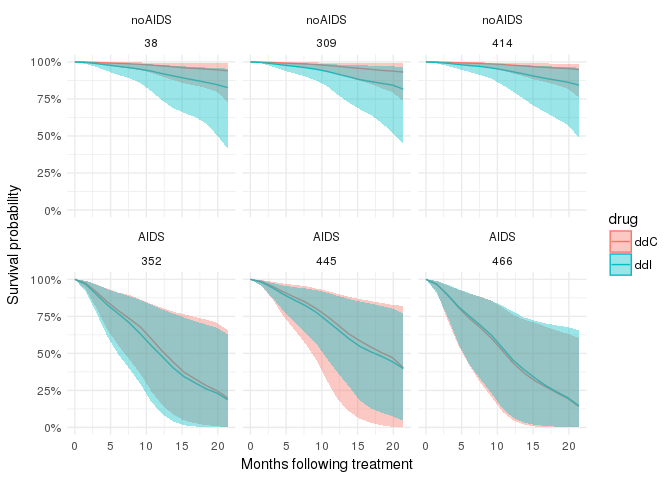

#### Plot expected CD4 counts over time

``` r
# plot expected `CD4` counts under two scenarios
patient_ppint %>% 
  dplyr::bind_rows(patient_ppint_alt) %>%
  ggplot(., aes(x = obstime, y = median, group = drug, colour = drug)) + 
  geom_line() +
  facet_wrap(prevOI ~ patient) +
  geom_ribbon(aes(ymin = `5%`, ymax = `95%`, colour = NULL, fill = drug), alpha = 0.2)
```

    ## Warning in bind_rows_(x, .id): binding factor and character vector,
    ## coercing into character vector


Look at model `f8`
------------------

As a comparison, look at model `f8` which includes CD4 count at baseline as a covariate in the survival submodel.

``` r
f8 <- readRDS(file.path(CACHE_DIR, 'f8.rds'))
print(f8)
```

    ## stan_jm(formulaLong = sqrt_cd4 ~ obstime + drug + obstime:drug + 
    ##     gender + prevOI + AZT + (1 + obstime | patient), dataLong = aids2, 
    ##     formulaEvent = Surv(Time, death) ~ drug + prevOI + drug:prevOI + 
    ##         gender + AZT + CD4, dataEvent = aids.id, time_var = "obstime", 
    ##     assoc = c("etavalue", "etaslope"), basehaz = "bs", chains = 4, 
    ##     adapt_delta = 0.999)
    ## 
    ## Longitudinal submodel: sqrt_cd4
    ##                 Median MAD_SD
    ## (Intercept)      3.085  0.133
    ## obstime         -0.042  0.005
    ## drugddI          0.065  0.076
    ## gendermale      -0.002  0.121
    ## prevOIAIDS      -0.871  0.096
    ## AZTfailure      -0.078  0.093
    ## obstime:drugddI  0.005  0.007
    ## sigma            0.370  0.011
    ## 
    ## Event submodel:
    ##                    Median MAD_SD exp(Median)
    ## drugddI             1.137  0.424  3.116     
    ## prevOIAIDS          1.266  0.379  3.546     
    ## gendermale         -0.354  0.278  0.702     
    ## AZTfailure          0.139  0.174  1.149     
    ## CD4                -0.001  0.064  0.999     
    ## drugddI:prevOIAIDS -0.915  0.439  0.401     
    ## Long1|etavalue     -0.958  0.344  0.384     
    ## Long1|etaslope     -4.069  8.097  0.017     
    ## basehaz-coef1      -4.514  1.072     NA     
    ## basehaz-coef2      -1.924  0.974     NA     
    ## basehaz-coef3      -3.653  0.925     NA     
    ## basehaz-coef4      -1.414  0.923     NA     
    ## basehaz-coef5      -3.513  1.070     NA     
    ## basehaz-coef6      -2.267  1.388     NA     
    ## 
    ## Group-level random effects:
    ##  Groups  Name              Std.Dev. Corr
    ##  patient Long1|(Intercept) 0.76535      
    ##          Long1|obstime     0.03679  0.02
    ## Num. levels: patient 467

``` r
# plot expected survival probabilities under two scenarios
patient_ppsurv8 %>%
  dplyr::left_join(patient_data.id %>% dplyr::select(-obstime), by = 'patient') %>%
  dplyr::bind_rows(patient_ppsurv_alt8 %>%
                     dplyr::left_join(patient_data_alt.id %>% dplyr::select(-obstime), by = 'patient')
                   ) %>%
  dplyr::arrange(prevOI, patient) %>%
  ggplot(., aes(x = obstime, y = survpred, group = drug, colour = drug)) +
  geom_line() +
  geom_ribbon(aes(ymin = ci_lb, ymax = ci_ub, fill = drug, colour = NULL), alpha = 0.4) +
  facet_wrap(prevOI~patient) +
  theme_minimal() +
  scale_x_continuous('Months following treatment') +
  scale_y_continuous('Survival probability', labels = percent)
```

    ## Warning in bind_rows_(x, .id): binding factor and character vector,
    ## coercing into character vector

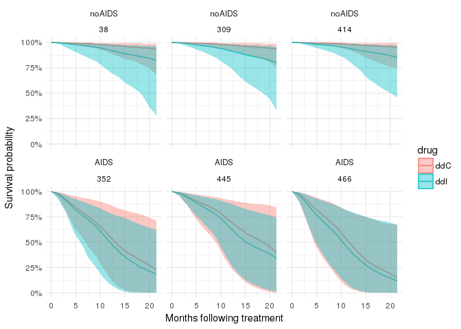
